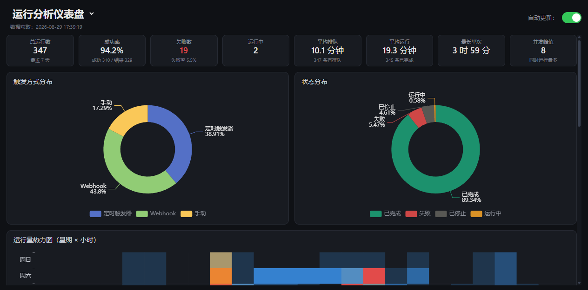
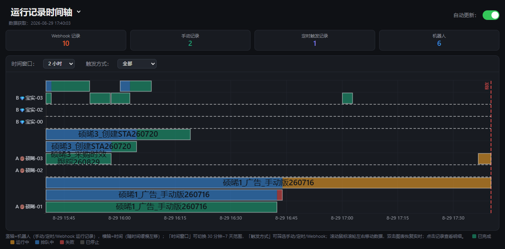
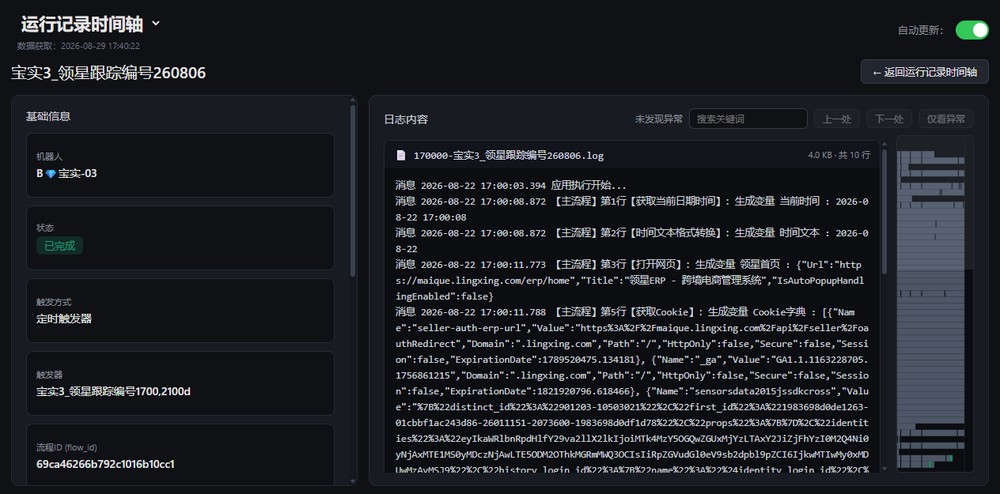
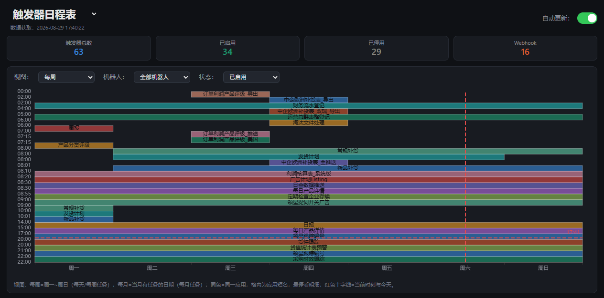

# 八爪鱼 RPA 触发器 & 运行记录仪表盘

抓取八爪鱼 RPA 企业管理台的机器人触发器和运行记录，**前后端分离**的局域网单页仪表盘：

- **运行数据分析**：概览指标 + 触发/状态分布 + 星期×小时热力图 + 各机器人排队与负载 + 失败看板
- **任务时间轴**：每台机器人的真实运行记录（手动 / 定时 / Webhook），排队与执行两段彩色区分
- **运行记录详情**：单条记录的完整信息、局域网共享日志目录检索、VSCode 风格缩略图导航、异常高亮与搜索
- **项目控制台**：全项目列表（排序/搜索色块）+ 项目详情 + 一键运行 + 飞书云端配置查看修改
- **触发器排期**：触发器每周/每月循环任务时刻表

## 效果图

### 运行数据分析（默认主页）



### 任务时间轴



### 运行记录详情（含日志缩略图）



### 触发器排期



## 架构

前后端分离（同项目目录），**数据零落盘**——output 不再堆 HTML 文件：

```
crawler.py ──爬取──▶ output/*.csv（数据源）
                        │
dashboard.py ──▶ 数据聚合模块（load_records / build_schedule_payload，不再生成 HTML）
                        │
local_server.py ──▶ 启动时/刷新/每日更新后载入内存
    GET  /                  → web/index.html（单页骨架）
    GET  /echarts.min.js    → 本地 ECharts
    GET  /api/runs           → 时间轴/分析共用数据（JSON）
    GET  /api/run?id=        → 单条详情
    GET  /api/schedule       → 触发器日程
    GET  /api/log            → 日志列表 + 按行分段（白名单内 UNC 共享）
    POST /api/refresh        → 只跑爬取 + 重载内存
                        │
web/（纯前端，hash 路由五视图）：
    index.html + app.js + style.css
    #/analysis（默认主页） #/timeline #/detail?id= #/schedule #/projects
```

## 一键启动

**双击 `E:\bazhuayu_crawler\start_server.bat`**，完成数据更新并启动局域网服务器（端口 `8000`）：

```
1. 抓取      crawler.py    触发器 + 运行记录 → output/triggers_normalized.csv / runs_normalized.csv
2. 整理      organize.py   按机器人整理时刻表 → output/schedule_all.md / .xlsx / .csv
3. 局域网服务器 local_server.py  启动 → http://localhost:8000/
```

服务器启动后**数据进内存**，网页通过 JSON API 动态渲染——`output/` 不再生成任何 HTML，详情页等按需拉取，不会越积越多。

启动横幅会输出本机局域网 IP，其他电脑用 `http://<本机IP>:8000` 访问；关窗即停止。

## 五个视图

> 顶部大标题即导航：**悬停自动展开**视图菜单（触屏设备点标题展开），当前视图高亮；运行数据分析为默认主页。

### 运行数据分析（`/` 默认主页）

- 8 个概览指标卡：总运行数、成功率、失败数、运行中、平均排队/运行、最长单次、并发峰值
- 触发方式分布、状态分布 两个饼图
- 星期 × 小时 热力图（找出运行高峰时段）
- 各机器人平均排队时长条形图 + 机器人负载榜
- 失败记录看板，支持「导出失败记录 CSV」
- 「自动更新」开关（勾选后每 60 秒从服务器拉新数据）

### 任务时间轴

- **竖轴 = 机器人**（同一机器人时间重叠的记录自动分多行泳道堆叠），**横轴 = 时间**（右缘=当前时刻，内容随时间缓慢左移）
- **4 个指标卡**：Webhook 记录 / 手动记录 / 定时触发记录 / 机器人
- **数据拆分**：每条记录按「排队（蓝）→ 执行（状态色）」两段区分，整条用白色边框框起
- **时间窗口**：30 分钟 ~ 7 天；**触发方式筛选**：全部 / 手动 / 定时触发器 / Webhook
- 滚轮：向下 = 向未来（最多到"现在"），向上 = 向过去
- 双击图表：恢复实时跟随
- 点击「运行中（Executing）」数据块：顶部弹出提示，不会跳转（运行中记录仍可点其他状态查看）

### 运行记录详情

- 左侧基础信息卡：机器人、状态、触发方式、触发器、流程 ID/编号、起止时间、排队/运行时长
- 右侧日志内容卡：工具栏（异常数、搜索、上一处/下一处/仅看异常）
- 日志来自**局域网共享 UNC 目录**（`robot_logs.json` 白名单）
- **大日志分段加载**：首段自动加载 2000 行，「加载更多」继续加载，避免大文件卡死
- **VSCode 风格缩略图（minimap）**：右侧缩略条，错误/警告行用红/橙色高亮，可点击/拖拽跳转
- **异常高亮 + 搜索过滤**：「仅看异常」/ 关键词搜索自动定位

### 触发器排期

- 视图切换：每周（横轴周一~周日）/ 每月（横轴当月有任务日期）
- 筛选：机器人（按名称前缀）、状态（已启用/已停用/全部）
- 按应用配色（12 色），同色 = 同一应用
- 红色虚线 = 当前时刻与今天（10 秒刷新）

### 项目控制台（`#/projects`）

- 左侧全项目列表（八爪鱼云端 flows，38 个），可按「修改时间 / 名称」排序、手动刷新，项目名前带按首字配色的色块
- 右侧选中项目详情：flowId / 更新时间 / 负责人；「运行该应用」按钮 + 飞书配置 / 运行记录 tab 切换
- **运行控制**：一键触发该应用运行（自动复用该项目历史成功运行的机器人）；运行记录表格点击跳详情页看日志
- **飞书配置**：项目 ↔ 配置组映射（存配置中心 `group=project` 组，key=`p.<flowId>`）；
  有映射自动加载，表格内直接修改 value 保存、底部可新增配置项

## 数据更新机制

| 调度 | 频率 | 内容 |
|---|---|---|
| 网页自动更新 | 每 60 秒（可选） | 勾选后向 `/api/refresh` 请求；服务器 60 秒内去重直接返回最新数据 |
| 每日完整更新 | 每天 12:00 | 爬取触发器、整理时刻表、刷新内存数据 |

只需打开 `start_server.bat`，让浏览器保持页面打开即可持续自动更新运行记录。

## 手动执行

```bash
python crawler.py --config config.json --out output
python crawler.py --config config.json --out output --only-runs --days 7     # 仅快速刷新运行记录
python organize.py --input output\triggers_normalized.csv --out output
python local_server.py                                                        # 仅启动服务器
```

> 旧版 `dashboard.py --only-gantt` 已废弃——前后端分离后不再需要生成静态页面。

## 配置（`config.json`）

> ⚠️ `config.json` 含登录凭据，已在 `.gitignore` 中排除；首次使用请复制 `config.example.json` 为 `config.json` 并填入。

| 字段 | 说明 |
|---|---|
| `account.username / password` | 八爪鱼 RPA 登录邮箱/手机号 + 密码（自动登录，会话缓存到 `output/session.json`） |
| `cookie` | 备用：浏览器登录后 F12 → `document.cookie` 填入 |
| `enterprise_id` | 可选：指定企业 ID；留空则默认选账号下第一个非个人企业 |
| `include_robots` | 只保留名称以这些前缀开头的机器人（如 `["A", "B"]` 或 `["A🍩硕晞-", "B💎宝实-"]`） |
| `exclude_robots` | 排除名称含这些关键词的机器人（如 `["测试"]`） |
| `feishu.app_id / app_secret` | 飞书自建应用凭据（项目控制台页读/写配置中心用） |
| `feishu.app_token / table_id` | 飞书多维表格「rpa_config」配置中心表的 app_token / table_id |
| `access_password` | 可选：仪表盘访问密码（`local_server.py` 启用 Cookie 鉴权，空则不启用） |

> **登录态过期自动恢复**：会话缓存到 `output/session.json`，过期后 `crawler.py` 会先验证缓存会话是否有效，失效则自动删除并改用 `account` 的账号密码重新登录（因此请务必在 `config.json` 中填好账号密码，而不仅依赖 cookie）。`local_server.py` 的 `/api/refresh` 在刷新失败时会如实返回 `ok=false`，网页顶部会提示"刷新失败，登录态可能已过期"。

## 项目结构

```
bazhuayu_crawler/
├── crawler.py              # 抓取触发器 + 运行记录
├── dashboard.py            # 数据聚合模块（load_records / build_schedule_payload）
├── local_server.py         # 局域网 HTTP 服务器 + JSON API（端口 8000）
├── organize.py             # 按机器人整理时刻表（生成 md/xlsx/csv 文档）
├── start_server.bat        # 一键：更新 + 启动服务器（双击）
├── config.example.json     # 配置模板
├── robot_logs.json         # 日志目录白名单（机器人 → 共享根目录）
├── assets/
│   ├── echarts.min.js      # ECharts（本地，离线可用）
│   └── effect_*.png        # 效果图（README 引用）
├── web/                    # 纯前端（前后端分离）
│   ├── index.html          # 单页骨架 + hash 路由五视图
│   ├── app.js              # 路由 + 时间轴/分析/详情/日程 渲染
│   └── style.css
└── output/                 # 抓取数据 + 整理文档（git 忽略，HTML 不再生成）
```
