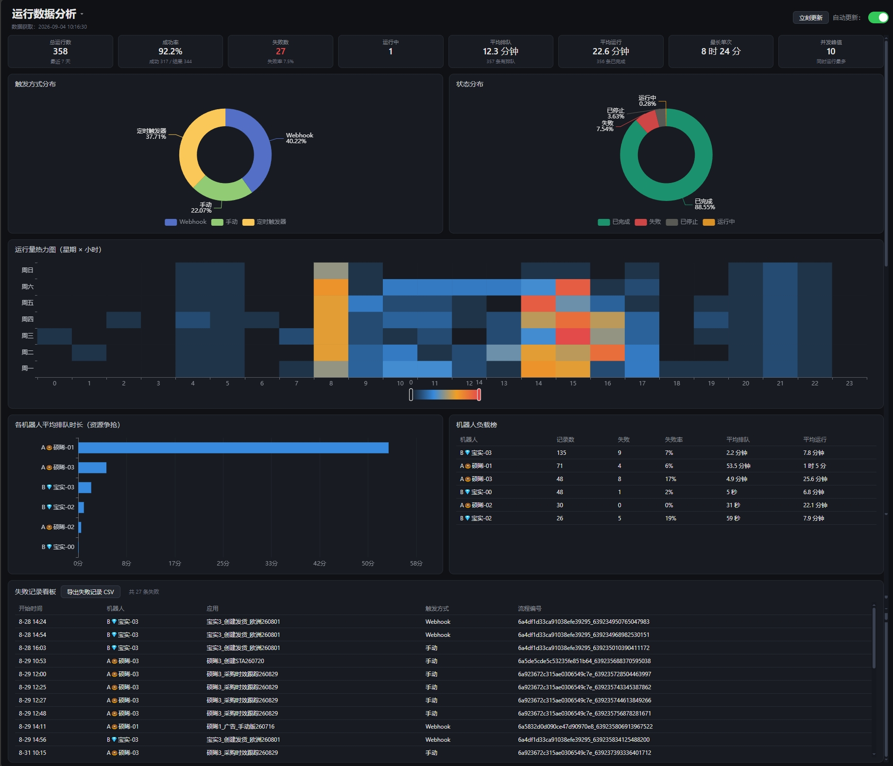
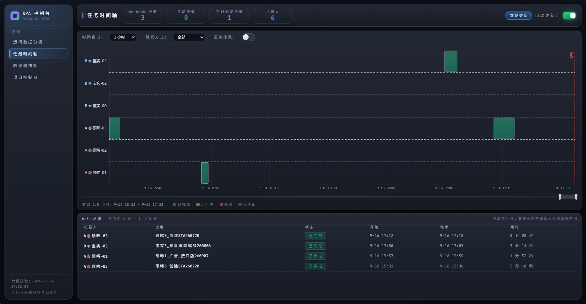
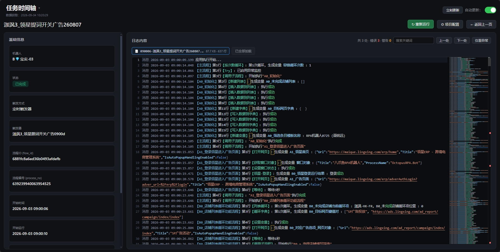
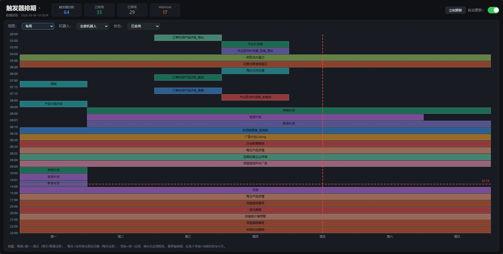
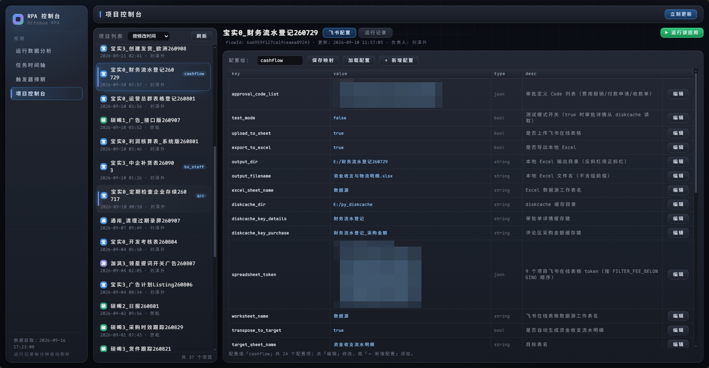

# 八爪鱼 RPA 触发器 & 运行记录仪表盘（octopus-rpa-console-dashboard）

抓取八爪鱼 RPA 企业管理台的机器人触发器和运行记录，**前后端分离**的局域网单页仪表盘：

- **运行数据分析**：概览指标 + 触发/状态分布 + 星期×小时热力图 + 各机器人排队与负载 + 失败看板
- **任务时间轴**：每台机器人的真实运行记录（手动 / 定时 / Webhook），排队与执行两段彩色区分
- **运行记录详情**：单条记录完整信息、局域网共享日志目录检索、Monaco 只读查看器（VSCode 同款高亮/minimap）、异常高亮与搜索、一键重新运行
- **项目控制台**：云端项目列表 + 项目详情 + 一键运行 + 飞书配置中心在线编辑
- **触发器排期**：触发器每周/每月循环任务时刻表

## 效果图

### 运行数据分析（默认主页）



### 任务时间轴



### 运行记录详情（含日志缩略图）



### 触发器排期



### 项目控制台



## 快速开始

```bash
# 1. 环境：Python 3.9+
pip install -r requirements.txt          # requests（抓取）+ openpyxl（整理时刻表）

# 2. 配置：复制模板并填入账号密码
cp config.example.json config.json

# 3. 启动：双击 start_server.bat（Linux/macOS 用 ./start_server.sh；只要起服务就 python local_server.py）
```

浏览器打开 `http://localhost:8000`；局域网其他电脑用 `http://<本机IP>:8000`。

> 首次运行若提示缺少 `requests`，两个一键脚本都会自动 `pip install`（找不到 Python 则报错退出）。

## 架构

前后端分离（同项目目录），**数据零落盘**——`output/` 不再堆 HTML 文件：

```
crawler.py ──爬取──▶ output/*.csv（数据源）
                        │
dashboard.py ──▶ 数据聚合模块（load_records / build_schedule_payload，不生成 HTML）
octo_api.py ──▶ 八爪鱼云端调度 API（项目列表 / 触发运行）
feishu_cfg.py ─▶ 飞书多维表格配置中心读写
                        │
local_server.py ──▶ 启动时/刷新/每日更新后载入内存
                        │
web/（纯前端，hash 路由五视图）
    index.html + app.js + style.css + theme.css + mobile.css + theme.js + fonts/
    #/analysis（默认主页） #/timeline #/detail?id= #/schedule #/projects
    # 版面：左侧固定导航栏（品牌 + 四视图 + 数据时间）+ 右侧主内容区
    # 桌面端（>880px）：theme.js 按窗口高度等比缩放 --s，所有内容压进一屏、不出原生滚动条
    # 手机端（≤880px）：mobile.css 整体换一套布局，自然文档流 + 整页滚动（详见「手机端适配」）
    # theme.css 为视觉增强层（配色/质感/动效/字体），删掉 index.html 里的引用即可回退原样式
    # mobile.css 为手机端布局层，删掉引用即回到桌面那套窄屏表现
```

### 后端接口

| 方法 | 路径 | 说明 |
|---|---|---|
| GET | `/` | 单页骨架（`web/index.html`） |
| GET | `/echarts.min.js` | 本地 ECharts（离线可用） |
| GET | `/monaco/vs/...` | Monaco Editor 静态资源（日志高亮） |
| GET / POST | `/login` | 登录页 / 提交访问密码（Cookie 30 天） |
| GET | `/api/runs` | 运行记录（时间轴、分析视图共用，来自内存缓存） |
| GET | `/api/run?id=` | 单条记录详情（含日志目录解析） |
| GET | `/api/schedule` | 触发器日程（周/月视图 + 统计） |
| GET | `/api/log?dir=&file=&offset=&limit=` | 日志目录文件列表 / 按行分段取内容 |
| GET | `/api/projects` | 云端项目（flows）列表 + 各项目配置组映射 |
| GET | `/api/projects/config?group=` | 读取某配置组全部配置项 |
| POST | `/api/projects/config` | 新增/更新配置项（后端做类型与格式校验） |
| POST | `/api/projects/run` | 触发某应用运行（自动复用历史成功机器人） |
| POST | `/api/rerun` | 详情页「重新运行」（按 flow_id 触发） |
| POST | `/api/refresh[?force=1]` | 爬取 + 重载内存；`force=1` 跳过 60 秒节流 |

> 所有 `/api/*` 与页面在设置了 `access_password` 后均需登录，未授权返回 401 并跳转 `/login`。

## 一键启动

Windows 用 `start_server.bat`、Linux/macOS 用 `start_server.sh`，两者**功能一致**，都是四步：

```
1. 检查端口  8000 被占用则列出占用进程，确认后清空
2. 抓取      crawler.py    触发器 + 运行记录 → output/triggers_normalized.csv / runs_normalized.csv
3. 整理      organize.py   按机器人整理时刻表 → output/schedule_all.md / .xlsx / .csv
4. 启动      local_server.py  → http://localhost:8000/
```

**端口处理**：发现占用会打印占用进程的 PID、进程名与命令行，问一句
`Kill the process(es) above and continue? [y/N]`——回答 `N` 原样退出（不动任何进程）；回答 `Y`
先温和结束（Linux `kill` / Windows `taskkill`），10 秒不退再强制结束，端口确认释放后才继续。

```bat
start_server.bat          :: Windows：双击也行
start_server.bat -y       :: 端口被占用时不再询问，直接清空（计划任务用）
start_server.bat silent   :: 只静默更新数据（日志 output\update_log.txt），不启动服务

chmod +x start_server.sh  # Linux/macOS：只需一次
./start_server.sh         # 端口被占用时会停下来问你
./start_server.sh -y      # 不再询问，直接清空端口（cron / systemd 用）
./start_server.sh silent  # 只静默更新数据，不启动服务
```

- **两个脚本的输出全为 ASCII 英文**（注释也是）：cmd.exe 按 OEM/ANSI 代码页读 `.bat`，
  Linux 终端 locale 不是 UTF-8 时同样如此——只要文件里有中文，提示就会变乱码。
  改这两个脚本时请继续保持纯 ASCII。
- 非交互场景（cron、systemd、计划任务、`< /dev/null`）**必须加 `-y`**：脚本检测到没有终端
  可询问时会拒绝执行并给出提示，而不是默默杀掉进程。
- `.sh` 必须是 LF 换行（从 Windows 传过去先 `sed -i 's/\r$//' start_server.sh`，否则报
  `bad interpreter`）；端口号从 `local_server.py` 的 `PORT` 读，也可用环境变量 `PORT` 临时覆盖。
- 服务器启动后**数据进内存**，网页通过 JSON API 动态渲染，详情页按需拉取。
- 启动横幅会输出本机局域网 IP；关窗（或 Ctrl+C）即停止。
- 换端口/换机器不用改脚本：`PORT` 只在 `local_server.py` 里定义一处。

## 标题栏（全局）

> 顶部大标题即导航：**悬停自动展开**视图菜单（触屏设备点标题展开），当前视图高亮；运行数据分析为默认主页。

| 元素 | 说明 |
|---|---|
| 导航菜单 | 五个视图切换，按钮与列表之间有透明桥接层，鼠标下移不会闪收 |
| 数据获取时间 | 数据源**成功爬取完成**的时刻；刷新失败会追加「（刷新失败）」红字提示 |
| 立刻更新 | 立即爬取最新数据，跳过 60 秒节流；按钮反馈 `更新中… → ✓ 已更新 / ✗ 失败` |
| 自动更新 | 默认开启，每 60 秒请求一次 `/api/refresh`（服务端 60 秒内去重，直接返回内存数据） |
| 指标卡 | 按视图切换：时间轴显示 Webhook/手动/定时记录数与机器人数；触发器排期显示触发器总数/已启用/已停用/Webhook |

## 五个视图

### 运行数据分析（`#/analysis`，默认主页）

- 8 个概览指标卡：总运行数、成功率、失败数、运行中、平均排队、平均运行、最长单次、并发峰值（统计口径为最近 7 天）
- 触发方式分布、状态分布 两个饼图
- 星期 × 小时 热力图（找出运行高峰时段）
- 各机器人平均排队时长条形图 + 机器人负载榜（记录数/失败/失败率/平均排队/平均运行，失败率 ≥20% 标红）
- 失败记录看板，支持「导出失败记录 CSV」（带 BOM，Excel 直接打开不乱码）

### 任务时间轴（`#/timeline`）

- **竖轴 = 机器人**（同一机器人时间重叠的记录自动分多行泳道堆叠），**横轴 = 时间**（右缘=当前时刻，内容随时间缓慢左移）
- **数据拆分**：每条记录按「排队（蓝）→ 执行（状态色）」两段区分，整条用白色边框框起；块内文字单行居中、过长截断加 `...`，少于 8 字不显示
- **时间窗口**：30 分钟 ~ 7 天（默认 2 小时；窄高窗口自动改为 6 小时，横向更舒展）
- **触发方式筛选**：全部 / 手动 / 定时触发器 / Webhook
- **横向滚动条**：图表上方的拖拽条与滚轮、双击行为一致，触屏可直接拖
- 滚轮：向下 = 向未来（最多到"现在"），向上 = 向过去；双击图表：恢复实时跟随
- 所有状态的数据块（含运行中）点击均可跳转详情查看日志

### 运行记录详情（`#/detail?id=`）

- 左侧基础信息卡：机器人、状态、触发方式、触发器、流程 ID（flow_id）、流程编号（process_no）、起止时间、开始运行、排队/运行时长
- 顶部按钮：**↻ 重新运行**（调用 `/api/rerun`，弹窗返回批次号与执行机器人）、**⚙ 项目配置**（跳转 `#/projects?fid=` 并选中该项目）、**← 返回上一页**（无历史兜底回时间轴）
- 右侧日志内容卡：工具栏（异常数、搜索、上一处/下一处/仅看异常）+ 多文件标签栏（大小/行数）
- 日志来自**局域网共享 UNC 目录**（`robot_logs.json` 白名单）
- **Monaco 只读日志查看器**（VSCode 编辑器内核，`assets/monaco/` 离线自托管）：
  - **按八爪鱼日志的固定格式逐段着色**（格式：`级别 时间戳 【子流程】第N行【指令】：内容`）：
    - 行首级别：错误红 / 警告橙 / 消息灰；时间戳灰蓝
    - `【子流程名】` 蓝、`【指令类型】` 青绿（靠后文「第N行」自动区分）
    - `生成变量 变量名` 中的变量名浅蓝；文件路径（盘符/UNC）淡蓝
  - **结构化内容识别**：字典键名浅蓝、字符串值橙、true/false/null 蓝字（对齐 VSCode JSON 配色），花括号与列表方括号灰蓝、元素逐个着色
  - **避免误标**：`已启用异常监控`、`超时[2228/180000]`（等待静默的进度计数）这类含级别词但非异常的内容不着色
  - 内置 minimap 缩略图 + 概览标尺（错误/警告行红/橙刻度）
  - **超长行自动折叠**：换行后超过 3 个显示行的日志默认收起（只保留约 3 行预览 + 「⋯ 已折叠」提示条），点击**最左行号**或行首 ▸ 箭头展开/收起；搜索时含关键词的折叠行自动展开，异常统计按原文判定不受折叠影响
  - 多文件以标签页切换，单编辑器多模型，切换零重建
- **大日志分段加载**：首段 5000 行，「加载更多」按行增量追加（不重置滚动位置）

### 触发器排期（`#/schedule`）

- 视图切换：每周（横轴周一~周日，纵轴为时刻）/ 每月（横轴当月有任务的日期）
- 筛选：视图、机器人（含「所有硕晞」「所有宝实」快捷分组 + 单机器人）、状态（已启用/已停用/全部，默认已启用）
- 指标卡：触发器总数 / 已启用 / 已停用 / Webhook
- 按应用配色（12 色），同色 = 同一应用；同一时刻多个应用分组堆叠，格内为应用短名，悬停看明细
- 红色虚线 = 当前时刻与今天（10 秒刷新）

### 项目控制台（`#/projects`）

- 左侧全项目列表（八爪鱼云端 flows），可按「修改时间 / 名称」排序、手动刷新；项目名首字带色块（宝蓝/硕绿/国橙/泇紫/财金等固定映射，其余按首字取色，X 固定灰）
- 右侧详情：项目名、flowId、更新时间、负责人；标题行右侧 tab（飞书配置 / 运行记录）+「▶ 运行该应用」按钮
- **运行控制**：一键触发运行，未指定机器人时自动复用该项目历史成功运行的机器人（避免被平台分配到无权限机器人报「没有操作权限」）
- **运行记录 tab**：该项目最近 7 天的记录，最多展示 20 条（状态/机器人/触发方式/起止/时长），点击跳详情页看日志
- **飞书配置 tab**：
  - 项目 ↔ 配置组映射（存配置中心 `group=project` 组，key=`p.<flowId>`），「保存映射」后自动加载
  - 配置表格含 key / value / type / desc，json 类型展示时自动排版；「编辑」或「＋ 新增配置」在弹窗中修改
  - 弹窗：编辑时 key 锁定、type 下拉（string/number/bool/json）、bool 开关、json 自动格式化；desc 保存时去除换行
  - 后端校验：group/key 仅允许 `字母数字._-`，number 需可转数字，bool 仅接受 true/false，json 需可解析（存储时压成紧凑单行）
  - 列表/配置/运行记录加载时显示全屏半透明遮罩，防止加载中误操作

## 手机端适配

桌面端与手机端是**互斥的两套布局逻辑**，断点统一取 `880px`（`mobile.css`、`theme.js`、
`app.js` 的 `MOBILE_Q` / `IS_MOBILE` 三处保持一致）：

| | 桌面端（>880px） | 手机端（≤880px） |
|---|---|---|
| 策略 | 禁止原生滚动条，内容压进一屏 | 自然文档流，整页纵向滚动（允许出现滚动条） |
| 缩放 | `theme.js` 写 `--s`，`.app` 等比缩放 | `--s` 归 1，`transform: none` |
| 左栏 | 214px 竖排固定栏 | 吸顶：品牌 + 数据时间 / 横向 tab（导航可直接点） |
| 指标卡 | 一行横排 | 每行两张（`box-sizing: border-box` + `calc(50% - 6px)`） |
| 图表 | 由 flex 分配剩余高度 | 固定高度（视口百分比 + 最小高度） |
| 宽表格 | 列自适应压缩 | 内容宽度 `max-content`，容器内横向滚动 |

实现要点：

- **`web/mobile.css` 是唯一的手机端布局层**，只在 `@media (max-width: 880px)` 内生效；
  删除 `index.html` 里这一行引用即可整体回退到桌面那套窄屏表现。
- **`web/theme.js`** 在断点两侧切换 `--s`（手机端归 1，避免与 `mobile.css` 打架），
  并把判定结果写到 `html[data-layout="mobile|desktop"]` 便于调试；跨断点自动重算。
- **`web/app.js`** 用 `IS_MOBILE` 分流 ECharts / Monaco 里 CSS 管不到的部分：
  时间轴左留白 100→76、y 轴标签宽 95→70、热力图刻度 11→9px、排期图块文字 20→11px、
  手机端关闭 Monaco 缩略图（minimap）。跨断点（拖动窗口 / 横竖屏切换）会自动重画，
  无需刷新页面。
- 布局层的两条坑（都已修）：flex 子项同时有百分比基准和 padding 时必须配
  `box-sizing: border-box`，否则两张「半宽」卡片永远排不进一行；不能给
  `#logbox`（Monaco 宿主）随手写 `flex: none`，那会让宽度退化成 7px 的竖线。

## 飞书配置中心

项目配置统一存放在飞书多维表格「rpa_config」（`config.json` 的 `feishu.app_token` / `table_id` 指定），表字段：

| 字段 | 说明 |
|---|---|
| `key` | 配置项短名，仅允许 `字母数字._-` |
| `value` | 配置值，一律以字符串存储，按 type 解析 |
| `type` | `string` / `number` / `bool` / `json` |
| `group` | 配置分组；`project` 组存项目↔配置组映射（key=`p.<flowId>`，value=配置组名） |
| `desc` | 说明（保存时自动去换行） |

读写封装在 `feishu_cfg.py`：`get_group_items` / `get_group_config` / `upsert_item` / `delete_item`；服务端接口为 `/api/projects/config`。

## 数据更新机制

| 调度 | 频率 | 内容 |
|---|---|---|
| 网页自动更新 | 每 60 秒（可选） | 向 `/api/refresh` 请求；服务器 60 秒内去重直接返回内存最新数据 |
| 立刻更新 | 手动 | `force=1` 跳过节流，立即爬取 |
| 快速刷新 | 由上面两者触发 | `crawler.py --only-runs --days 7`，只刷最近 7 天运行记录 |
| 每日完整更新 | 每天 12:00 | 爬取触发器 + 运行记录、整理时刻表、刷新内存，并刷新「数据获取」时间 |

- 刷新失败（如登录态过期且无法重新登录）会如实返回 `ok=false`，网页顶部红字提示「刷新失败，登录态可能已过期」，不会误报成功。
- 每次爬取/更新的输出摘要追加到 `output/update_log.txt`，排错先看这里。
- 完整更新与快速刷新之间用 `UPDATE_LOCK` 互斥，避免并发写 `output/`。

## 手动执行

```bash
python crawler.py --config config.json --out output                            # 全量抓取（触发器 + 运行记录）
python crawler.py --config config.json --out output --only-runs --days 7       # 仅快速刷新运行记录
python organize.py --input output\triggers_normalized.csv --out output         # 整理时刻表
python local_server.py                                                          # 仅启动服务器
start_server.bat silent                                                         # 静默更新（日志写入 output\update_log.txt）
```

> `dashboard.py` 已重构为数据聚合模块，直接执行只打印提示，不再生成任何 HTML。

## 配置

### `config.json`

> ⚠️ 含登录凭据，已在 `.gitignore` 中排除；首次使用请复制 `config.example.json` 并填入。

| 字段 | 说明 |
|---|---|
| `account.username / password` | 八爪鱼 RPA 登录邮箱/手机号 + 密码（自动登录，令牌缓存到 `output/octo_token.json`，会话缓存到 `output/session.json`） |
| `cookie` | 备用：浏览器登录后 F12 → `document.cookie` 填入 |
| `enterprise_id` | 可选：指定企业 ID；留空则默认选账号下第一个非个人企业 |
| `include_robots` | 只保留名称以这些前缀开头的机器人（如 `["A", "B"]` 或 `["A🍩硕晞-", "B💎宝实-"]`） |
| `exclude_robots` | 排除名称含这些关键词的机器人（如 `["测试"]`） |
| `feishu.app_id / app_secret` | 飞书自建应用凭据（项目控制台读/写配置中心用） |
| `feishu.app_token / table_id` | 飞书多维表格「rpa_config」配置中心表 |
| `access_password` | 可选：仪表盘访问密码（启用 Cookie 鉴权，空则不启用） |

> **登录态过期自动恢复**：令牌缓存到 `output/octo_token.json`，过期后 `octo_api.ensure_token` 会自动重新登录；爬虫侧会话过期会删除缓存并改用 `account` 的账号密码重登（因此请务必在 `config.json` 中填好账号密码，而不仅依赖 cookie）。

### `robot_logs.json`

机器人 → 局域网日志共享目录（UNC）白名单，详情页只在这些根目录内检索，防止任意文件读取：

```json
{
  "_说明": "键为机器人名，值为该机器人电脑共享出来的日志根目录 UNC 路径",
  "A🍩硕晞-01": "\\\\SX-01\\Logs",
  "B💎宝实-00": "\\\\BS-00\\Logs"
}
```

以 `_` 开头的键视为注释，不会加入白名单。

## 附：八爪鱼 RPA MCP 服务器（`octo_mcp/`）

让 AI 客户端直接操作八爪鱼 RPA 的 MCP 服务，与仪表盘共用同一份抓取数据：

| 工具 | 作用 |
|---|---|
| `octo_list_projects` | 列出本地流程项目 |
| `octo_read_subflow` / `octo_write_subflow` | 解密读取 / 加密回写 `.subflow` 流程文件 |
| `octo_search_flows` | 流程内全文搜索关键词 |
| `octo_list_backups` / `octo_restore_backup` | 备份列表 / 恢复 |
| `octo_get_key` | 查询当前 AES 密钥与重取方法 |
| `octo_list_triggers` / `octo_list_runs` | 触发器清单、运行记录（只读，读 `output/`） |

```bash
pip install "mcp<2" cryptography
```

`mcp.json` 配置示例：

```json
{
  "mcpServers": {
    "octopus-rpa": {
      "command": "<python.exe 路径>",
      "args": ["E:\\octopus-rpa-console-dashboard\\octo_mcp\\server.py"]
    }
  }
}
```

> 密钥可用环境变量覆盖：`OCTO_SUBFLOW_KEY` / `OCTO_SUBFLOW_IV`（HEX）。

## 项目结构

```
octopus-rpa-console-dashboard/
├── crawler.py              # 抓取触发器 + 运行记录
├── dashboard.py            # 数据聚合模块（load_records / build_schedule_payload）
├── local_server.py         # 局域网 HTTP 服务器 + JSON API（端口 8000）
├── organize.py             # 按机器人整理时刻表（生成 md/xlsx/csv）
├── octo_api.py             # 八爪鱼云端调度 API（登录/项目列表/触发运行）
├── feishu_cfg.py           # 飞书多维表格配置中心读写
├── start_server.bat        # 一键（Windows）：检查端口 → 更新 → 启动服务器
├── start_server.sh         # 一键（Linux/macOS）：同上，功能一致
├── requirements.txt        # requests / openpyxl
├── config.example.json     # 配置模板
├── robot_logs.json         # 日志目录白名单（机器人 → 共享根目录）
├── octo_mcp/
│   └── server.py           # MCP 服务器（流程文件读写/搜索/备份）
├── assets/
│   ├── echarts.min.js      # ECharts（本地，离线可用）
│   ├── monaco/vs/          # Monaco Editor（日志只读高亮，离线自托管）
│   └── effect_*.png        # 效果图（README 引用）
├── web/                    # 纯前端（前后端分离）
│   ├── index.html          # 单页骨架（左侧导航 + 主内容区）+ hash 路由五视图
│   ├── app.js              # 路由 + 时间轴/分析/详情/日程/项目控制台 渲染（含手机端图表分流）
│   ├── style.css           # 基础样式（布局与组件）
│   ├── theme.css           # 视觉增强层（配色/质感/圆角/动效，可整层回退）
│   ├── mobile.css          # 手机端布局层（≤880px 整体换布局，删除引用即可回退）
│   ├── theme.js            # 适配/装饰层（--s 等比缩放与断点判定、鼠标跟随光晕，失败静默降级）
│   └── fonts/
│       └── maple-mono.woff2  # 界面字体 Maple Mono（woff2，约 5.4 MB）
└── output/                 # 抓取数据 + 整理文档 + 更新日志（git 忽略）
```
