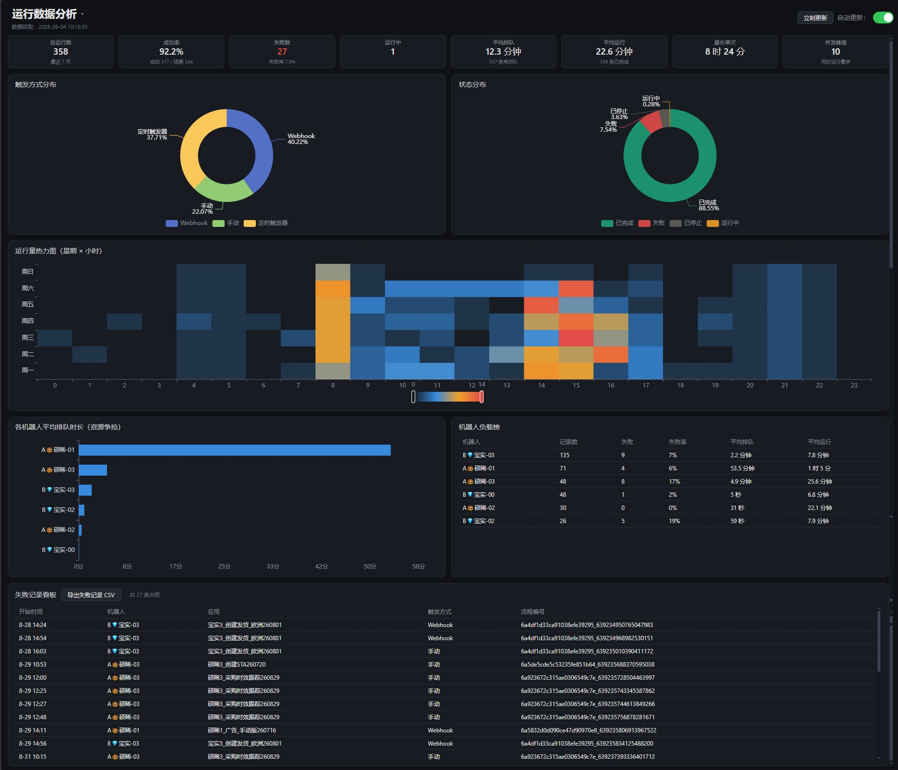
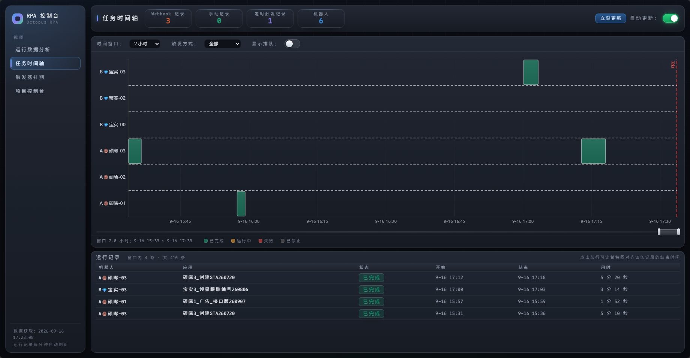
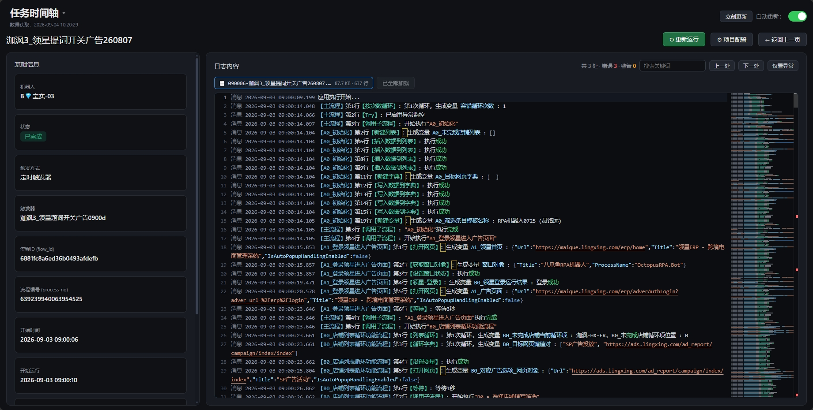
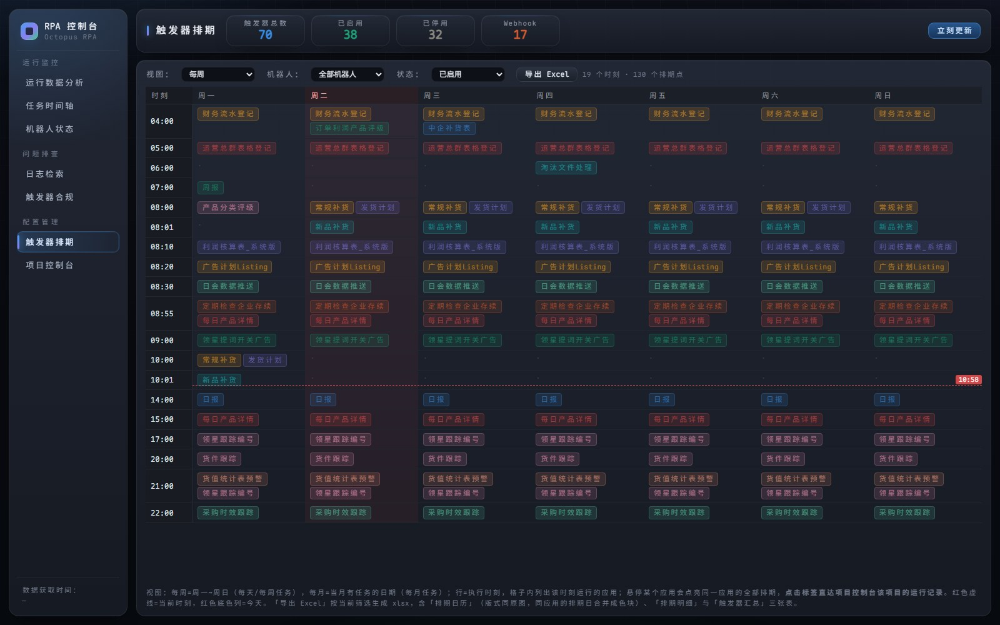
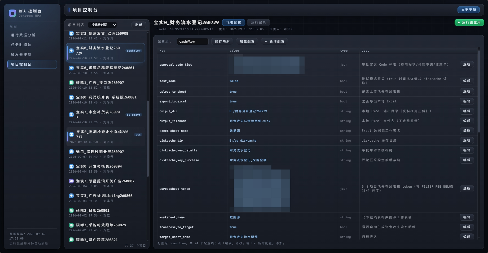
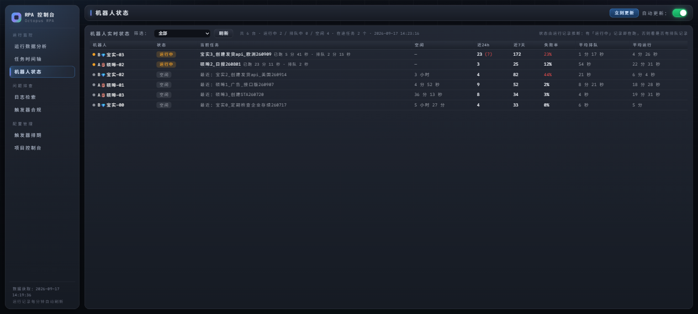
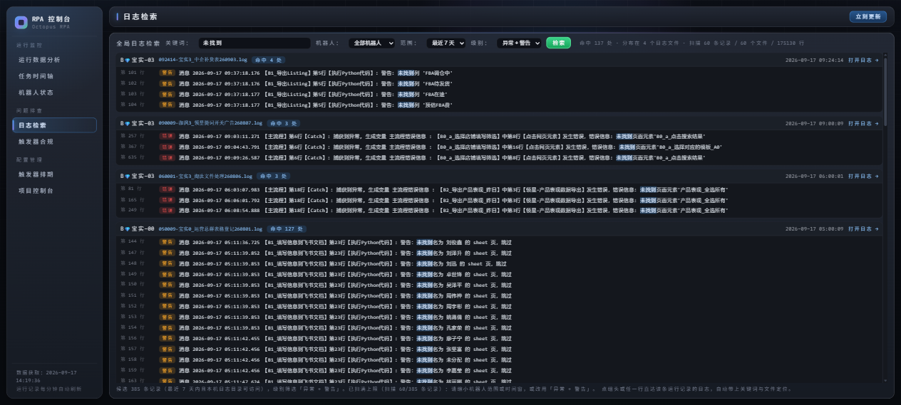
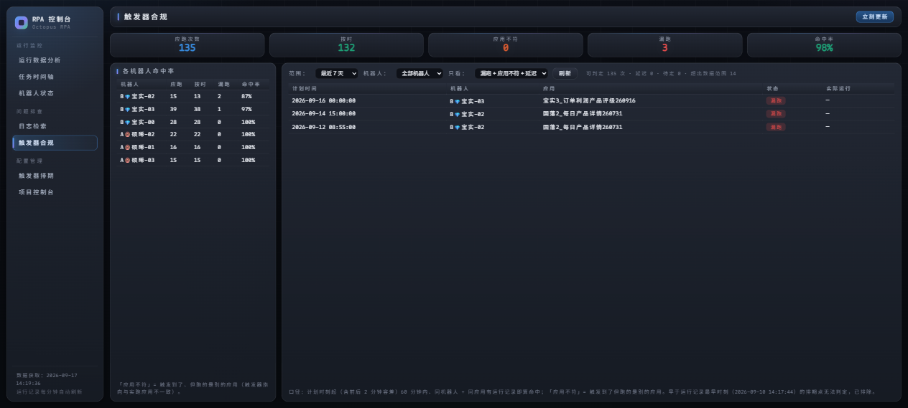

# 八爪鱼 RPA 触发器 & 运行记录仪表盘（octopus-rpa-console-dashboard）

抓取八爪鱼 RPA 企业管理台的机器人触发器和运行记录，**前后端分离**的局域网单页仪表盘：

- **运行数据分析**：概览指标 + 触发/状态分布 + 星期×小时热力图 + 各机器人排队与负载 + 失败看板
- **任务时间轴**：每台机器人的真实运行记录（手动 / 定时 / Webhook），排队与执行两段彩色区分
- **运行记录详情**：单条记录完整信息、局域网共享日志目录检索、Monaco 只读查看器（VSCode 同款高亮/minimap）、异常高亮与搜索、选择机器人后重新运行
- **项目控制台**：云端项目列表 + 项目详情 + 选择机器人运行 + 飞书配置中心在线编辑
- **触发器排期**：触发器每周/每月循环任务时刻表（行=时刻、列=周几的表格；点应用标签直达项目控制台运行记录）
- **机器人状态**（运行监控）：一个机器人一行，看每台在跑什么、排队/空闲多久、近 24 小时与近 7 天负载
- **日志检索**（问题排查）：跨机器人 + 跨运行记录搜日志关键词，结果按同一文件分组，可只筛异常/警告，命中直达详情页对应日志
- **触发器合规**（问题排查）：排期时刻 vs 实际运行比对，输出按时/延迟/应用不符/漏跑，含各机器人命中率

## 效果图

### 运行数据分析（默认主页）



### 任务时间轴



### 运行记录详情（含日志缩略图）



### 触发器排期



### 项目控制台



### 机器人状态（运行监控）



### 日志检索（问题排查）



### 触发器合规（问题排查）



## 快速开始

```bash
# 1. 环境：Python 3.9+
pip install -r requirements.txt          # requests（抓取）+ openpyxl（整理时刻表）+ pymysql（MySQL，可选）

# 2. 配置：复制模板并填入账号密码
cp config.example.json config.json

# 3. 启动：双击 start_server.bat（Linux/macOS 用 ./start_server.sh；只要起服务就 python local_server.py）
```

浏览器打开 `http://localhost:8000`；局域网其他电脑用 `http://<本机IP>:8000`。

> 首次运行若提示缺少 `requests`，两个一键脚本都会自动 `pip install`（找不到 Python 则报错退出）。

**MySQL 持久化（可选）**：config.json 加 `mysql` 段即启用，运行记录幂等 upsert 进
`rpa_runs` 表（主键 `process_no`；在途记录 8 秒先行入库，跑完的终态由 60 秒抓取覆盖；
时间存毫秒时间戳 + 北京时间 `start_dt`），未配置/连接失败时静默跳过、不影响任何功能。
建库建表在服务器启动时自动完成（也可手动 `python db.py init`，`python db.py stats` 查行数）：

```json
"mysql": { "host": "127.0.0.1", "port": 3306, "user": "root", "password": "", "database": "octopus_rpa" }
```

## 架构

前后端分离（同项目目录），**数据零落盘**——`output/` 不再堆 HTML 文件：

```
crawler.py ──爬取──▶ output/*.csv（全量快照；同时直接 upsert 入库）
                        │
dashboard.py ──▶ 数据聚合模块（build_bot_status / build_schedule_payload，不生成 HTML）
octo_api.py ──▶ 八爪鱼云端调度 API（项目列表 / 触发运行 / 运行记录+underway 轮询）
feishu_cfg.py ─▶ 飞书多维表格配置中心读写
xlsx_writer.py ─▶ xlsx 生成（纯标准库拼 zip + XML，支持合并单元格与单元格着色，内存生成不落盘）
db.py ──▶ MySQL 持久层 + 查询层（rpa_runs 幂等 upsert 与按需查询；config.json -> "mysql" 段）
                        │
local_server.py ──▶ MySQL 是唯一真相源：抓取直接入库，前端接口按需查库，无内存数据态
    ├─ runs_poller      每 60s：桌面 API runningRecords 拉最新 20 条（全状态含终态）
    │                   直接入库——不起子进程、不依赖网页版 Cookie 会话
    ├─ underway_poller  每  5s：桌面 API underway 轮询"运行中"记录（?start=0&take=500，
    │                   纯 REST 轮询；在途记录先行入库 end 为空，终态由上一行覆盖）
    └─ 每日 12:00 / 启动 / 手动「立刻更新」：crawler 网页版全量（触发器排期唯一来源）
                        │
web/（纯前端，hash 路由八视图）
    index.html + app.js + style.css + theme.css + mobile.css + theme.js + fonts/
    #/analysis（默认主页） #/timeline #/detail?id= #/schedule #/projects
    #/botstatus #/logsearch #/compliance（运维组）
    # 版面：左侧固定导航栏（品牌 + 三个分组导航 + 数据时间）+ 右侧主内容区
    # 桌面端（>880px）：theme.js 按窗口高度等比缩放 --s，所有内容压进一屏、不出原生滚动条
    # 手机端（≤880px）：mobile.css 整体换一套布局，自然文档流 + 整页滚动（详见「手机端适配」）
    # theme.css 为视觉增强层（配色/质感/动效/字体），删掉 index.html 里的引用即可回退原样式
    # mobile.css 为手机端布局层，删掉引用即回到桌面那套窄屏表现
```

### 后端接口

| 方法 | 路径 | 说明 |
|---|---|---|
| GET | `/` | 单页骨架（`web/index.html`） |
| GET | `/echarts.min.js` | 本地 ECharts（离线可用） |
| GET | `/monaco/vs/...` | Monaco Editor 静态资源（日志高亮） |
| GET / POST | `/login` | 登录页 / 提交访问密码（Cookie 30 天） |
| GET | `/api/runs` | 运行记录（时间轴、分析视图共用，按需查 MySQL） |
| GET | `/api/run?id=` | 单条记录详情（含日志目录解析） |
| GET | `/api/bots?flow_id=` | 可选执行机器人清单（本流程跑过的 / 在线可用 / 离线停用 + 历史与推荐） |
| GET | `/api/schedule` | 触发器日程（周/月视图 + 统计） |
| GET | `/api/schedule/export?view=&robot=&status=` | 按当前筛选导出 xlsx（日历 + 明细 + 汇总，内存生成附件下载） |
| GET | `/api/botstatus` | 各机器人实时状态（运行中/排队中/空闲 + 当前任务 + 近 24 小时/近 7 天负载）。在途记录由 underway 5 秒轮询先行入库，查库即最新；响应带 `live:{ok,age,count}` 实时层状态 |
| GET | `/api/compliance?days=&window=` | 触发器排期 vs 实跑比对（按时/延迟/应用不符/漏跑 + 各机器人命中率） |
| GET | `/api/logsearch?q=&robot=&days=&lvl=` | 跨运行记录检索日志关键词（`lvl=err` 仅错误 / `warn` 错误+警告） |
| GET | `/api/log?dir=&file=&offset=&limit=&refresh=` | 日志目录文件列表 / 按行分段取内容（`refresh=1` 额外返回 `anchor`/`total`，供详情页「刷新」判断增量追加还是整段重载） |
| GET | `/api/projects` | 云端项目（flows）列表 + 各项目配置组映射 |
| GET | `/api/projects/config?group=` | 读取某配置组全部配置项 |
| POST | `/api/projects/config` | 新增/更新配置项（后端做类型与格式校验） |
| POST | `/api/projects/run` | 触发某应用运行（`bot_id` 可选，不传则自动复用历史成功机器人） |
| POST | `/api/rerun` | 详情页「重新运行」（按 flow_id 触发，`bot_id` 可选） |
| POST | `/api/refresh[?force=1]` | 「立刻更新」：`force=1` 立即全量爬取 + 重载内存；不带 `force` 只回读内存缓存、不触发抓取 |

> 所有 `/api/*` 与页面在设置了 `access_password` 后均需登录，未授权返回 401 并跳转 `/login`。

## 一键启动

Windows 用 `start_server.bat`、Linux/macOS 用 `start_server.sh`，两者就是**一行 python 启动命令**：

```bat
@echo off
title RPA Dashboard Server
cd /d "%~dp0"
python core\local_server.py
pause
```

- 数据更新全部由 `local_server.py` 内部完成：启动 5 秒后先抓一轮运行记录，之后每 60 秒自动抓；
  underway 实时轮询每 8 秒；触发器排期每日 12:00 完整更新（含 organize）。无需任务计划。
- **`pause` 别删**：Python 启动报错时窗口会停住显示错误，而不是一闪而过。
- `python` 不在 PATH 时，把 bat 最后一行换成 python.exe 完整路径（或装 py launcher 用 `py -3`）。
- 端口 8000 被占用时直接报 `OSError: [Errno 98/10048] address already in use`——
  先关掉旧的 local_server 再启动；换端口改 `local_server.py` 的 `PORT` 一处即可。
- `.sh` 用 `python3`、必须 LF 换行；`.bat` 必须 CRLF 且纯 ASCII（`.gitattributes` 已锁定）。
- 服务器启动后**数据进内存**，网页通过 JSON API 动态渲染，详情页按需拉取。
- 启动横幅会输出本机局域网 IP；关窗（或 Ctrl+C）即停止。

## 标题栏（全局）

> 顶部大标题即导航：**悬停自动展开**视图菜单（触屏设备点标题展开），当前视图高亮；运行数据分析为默认主页。

| 元素 | 说明 |
|---|---|
| 导航菜单 | 八个视图切换，分「运行监控 / 问题排查 / 配置管理」三组；按钮与列表之间有透明桥接层，鼠标下移不会闪收 |
| 数据获取时间 | 后端最近一次**成功爬取完成**的时刻；「立刻更新」失败会追加「（刷新失败）」红字提示 |
| 立刻更新 | 立即全量爬取最新数据，不用等后端下一轮自动抓取；按钮反馈 `更新中… → ✓ 已更新 / ✗ 失败` |
| 自动更新 | 默认开启，每 60 秒读一次 `/api/runs`（后端内存缓存，纯读取、不触发任何抓取；后端状态如何都照常显示） |
| 指标卡 | **所有视图的指标卡统一放标题栏**（`#headMetrics`），按视图整组切换显隐（位置与 `HEAD_METRIC_BOXES` 一一对应）：时间轴=Webhook/手动/定时记录数+机器人；分析=总运行/运行中/失败等；排期=触发器总数/已启用/已停用/Webhook；项目=项目总数/已配映射/未配映射/配置组数；机器人状态=机器人/运行中/排队中/空闲/在途任务；日志检索=命中行/命中日志文件/候选记录/扫描行数；合规=应跑次数/按时/应用不符/漏跑/命中率 |

## 八个视图

> 侧栏按「看现状 / 查问题 / 改配置」分三组：
> **运行监控**（运行数据分析 / 任务时间轴 / 机器人状态）——现在与最近跑得怎么样；
> **问题排查**（日志检索 / 触发器合规）——哪出了问题、排期有没有漏；
> **配置管理**（触发器排期 / 项目控制台）——排期怎么设、项目配置与手动运行。
> 运行记录详情由链接进入，不在导航里。

### 运行数据分析（`#/analysis`，默认主页）

- 8 个概览指标卡：总运行数、成功率、失败数、运行中、平均排队、平均运行、最长单次、并发峰值（统计口径为全部已抓取记录，全量抓取后约 30 天）
- 触发方式分布、状态分布 两个饼图
- 星期 × 小时 热力图（找出运行高峰时段）
- 各机器人平均排队时长条形图 + 机器人负载榜（记录数/失败/失败率/平均排队/平均运行，失败率 ≥20% 标红）
- 失败记录看板，支持「导出失败记录 CSV」（带 BOM，Excel 直接打开不乱码）

### 任务时间轴（`#/timeline`）

> **桌面端是甘特图，手机端只有记录流** —— 两端策略完全不同，见下面各自的段落。
> 手机端把甘特图与筛选整块砍掉（`mobile.css` 里 `#tlFilter` / `#tlChartCard` 隐藏，
> `tlInit` 在手机端直接返回、不建 ECharts 实例）：390px 宽的甘特图，
> 无论转置还是压成缩略图，都读不出「运行顺序 + 时长」，不如把这一屏全给记录流。

#### 桌面端（甘特图 + 表格）

- **竖轴 = 机器人**（同一机器人时间重叠的记录自动分多行泳道堆叠），**横轴 = 时间**（右缘=当前时刻，内容随时间缓慢左移）
- **数据拆分**：每条记录按「排队（蓝）→ 执行（状态色）」两段区分，整条用白色边框框起；块内文字单行居中、过长截断加 `...`，少于 8 字不显示
- **极短记录不会被吞掉**：6 秒的记录在 6 小时窗口里只有 0.1px，原来按「不足 2px 不画」直接消失。现在以真实位置为中心撑到 4px 再画（只影响画出来的宽度，**不影响时长读数、拖动换算与点击跳转**，那些都按真实值走）。泳道分配仍按真实时间重叠算，与窗口大小无关，所以 7 天/30 天窗口下泳道数不会膨胀
- **筛选独立成卡片**：时间窗口 / 触发方式 / 显示排队 单独一张卡（原先贴在甘特图卡片顶部，和图表混在一起）
- **时间窗口**：下拉档位 30 分钟 ~ 7 天（默认 2 小时；窄高窗口自动改为 6 小时，横向更舒展）；Ctrl+滚轮可自由缩放到 10 分钟 ~ 30 天，下拉会自动留空表示「自定义窗口」
- **触发方式筛选**：全部 / 手动 / 定时触发器 / Webhook
- **直接拖动平移**：在图表上按住拖动即可平移时间轴，1:1 跟手（整幅长度 = 整个窗口宽度）；内容跟着手走（左=更晚、右=更早），拖到「现在」或最早数据处自动停住
- **底部窗口指示条**：滑块宽度 = 当前窗口占全部数据的比例（窗口越长滑块越宽），拖滑块或点轨道空白可平移；它只是指示器，窗口长度不能靠拖它改
- **缩放窗口**：`Ctrl/⌘ + 滚轮` 以鼠标所指时刻为锚点缩放（向上放大、向下缩小，范围 10 分钟 ~ 30 天）；也可用上方「窗口」下拉，或双击恢复默认
- 滚轮：向下 = 向未来（最多到"现在"），向上 = 向过去；双击图表：恢复实时跟随
- 「横向手势归平移、纵向仍可滚页面」；拖动后那一下不会误触发「点块进详情」
- 所有状态的数据块（含运行中）点击均可跳转详情查看日志
- **运行记录**：六列表格（机器人/应用/状态/开始/结束/用时），点某行让甘特图右边缘对齐该条记录的结束时间

#### 手机端（≤880px，纯记录流）

- **没有甘特图、没有筛选**：整屏就是一列运行记录，按**结束时间倒序**（最新跑完的在最上面；还在跑的 `end` 为空，永远置顶）
- **每张卡片**：左侧序号 + 应用名 + **右侧大号时长**（按状态着色）+ 机器人短名/状态/起止时刻/排队时长 + 底部一条按时长比例画的横条（谁长谁短不用读数字就能比出来）
- **日期分隔条**：跨天时插一条 `10-10` 的药丸，吸顶在导航下方，长列表里随时知道当前是哪天
- **动态无感翻页（两层）**：
  - **续批**：首屏 20 条，滚到底自动追加下一批（`IntersectionObserver` 盯底部哨兵，`rootMargin: 300px` 提前加载），底部显示「向下滚动加载更多… / 已到底 · 共 N 条」
  - **更新不跳位**：自动更新拉到新记录时，如果用户**还在顶部**就直接刷新；**已经滚下去了则一律不动 DOM**，只在屏幕底部浮一个「↑ N 条新记录」的药丸，点它才回顶部看新的 —— 正在看第 40 条时被新数据顶掉视线是最恼人的
  - 「进行中」记录的时长每 5 秒走一格，**只改那几行的文本**（`tlFeedTick`），不重排列表
- **点卡片直接进该条记录的日志详情**（没有甘特图要对齐，不需要「先对齐再点」两步）
- 标题栏四张指标卡（Webhook/手动/定时/机器人）在手机端按**全部记录**统计（没有时间窗口的概念）

### 运行记录详情（`#/detail?id=`）

- 左侧基础信息卡：机器人、状态、触发方式、触发器、流程 ID（flow_id）、流程编号（process_no）、起止时间、开始运行、排队/运行时长
- 顶部按钮：**↻ 重新运行**（**先弹窗选择执行机器人**，再调用 `/api/rerun`，返回批次号与执行机器人）、**⚙ 项目配置**（跳转 `#/projects?fid=` 并选中该项目）、**← 返回上一页**（无历史兜底回时间轴）
  - 弹窗数据来自 `/api/bots?flow_id=`，分三组：**本流程运行过的机器人**（默认选中最近一次成功运行的那台，带「推荐」标）、**在线可用的其他机器人**、**离线 / 已停用机器人**（默认收起）；另有「不指定，由平台分配」项
- 右侧日志内容卡：工具栏（异常数、搜索、上一处/下一处/仅看异常/**复制路径**）+ 多文件标签栏（大小/行数）
  - **↻ 刷新**（在「日志内容」标题右侧）：只看当前选中日志文件的**内容**，不必退出重进详情页——看实时日志时最常用
    - 实现是「重读文件」而不是「重建页面」：以已加载行数为偏移请求一页（`/api/log?...&refresh=1`），服务端顺带回一个锚点行（第 N 行原文）与当前总行数
    - 锚点行与本地最后一行一致 → 文件只是尾部追加，新行**增量接到 Monaco 模型末尾**，**滚动位置、搜索关键词、仅看异常、折叠状态全部保留**；有关键词时顺带把新行里的命中补上高亮
    - 锚点行不一致（文件被重写/轮转）→ 自动**整段重载**该文件并尽量停在原视口位置，避免新旧内容错接
    - 没有新内容时提示「已是最新（共 N 行）」；刷新中按钮图标转圈，请求结束自动恢复
    - 只影响当前标签对应的文件，其他文件的已加载内容与标签状态都不动
  - **复制路径**：一键把**当前选中日志文件**的完整共享路径（如 `\\SX-03\Logs\20260908\135111-…\135111-….log`）写进剪贴板，粘到资源管理器地址栏即可打开；切日志标签时复制目标跟着变
    - 成功反馈只把按钮**染绿 1.4 秒**（不改文案、不改尺寸），完整路径以屏幕底部轻提示回显
    - 局域网访问（`http://<IP>:8000`）不是安全上下文、`navigator.clipboard` 不可用，自动回落到 `textarea + execCommand`；两种方式都失败时提示手动复制
    - 共享目录未连上 / 文件清单读不出来时，退回复制该记录的**日志目录**并在提示里说明（该场景仍能复制）
- 日志来自**局域网共享 UNC 目录**（`config.json` -> `robot_logs` 白名单）
- **Monaco 只读日志查看器**（VSCode 编辑器内核，`assets/monaco/` 离线自托管）：
  - **按八爪鱼日志的固定格式逐段着色**（格式：`级别 时间戳 【子流程】第N行【指令】：内容`）：
    - 行首级别：错误红 / 警告橙 / 消息灰；时间戳灰蓝
    - `【子流程名】` 蓝、`【指令类型】` 青绿（靠后文「第N行」自动区分）
    - `生成变量 变量名` 中的变量名浅蓝；文件路径（盘符/UNC）淡蓝
  - **结构化内容识别**：字典键名浅蓝、字符串值橙、true/false/null 蓝字（对齐 VSCode JSON 配色），花括号与列表方括号灰蓝、元素逐个着色
  - **避免误标**：`已启用异常监控`、`超时[2228/180000]`（等待静默的进度计数）这类含级别词但非异常的内容不着色
  - 内置 minimap 缩略图 + 概览标尺（错误/警告行红/橙刻度）
  - **超长行自动折叠**：换行后超过 3 个显示行的日志默认收起（只保留约 3 行预览 + 「⋯ 已折叠」提示条），点击**最左行号**或行首 ▸ 箭头展开/收起；搜索时含关键词的折叠行自动展开，异常统计按原文判定不受折叠影响
  - 多文件以标签页切换，单编辑器多模型，切换零重建
- **大日志分段加载**：首段 5000 行，「加载更多」按行增量追加（不重置滚动位置）

### 触发器排期（`#/schedule`）

- **表格版式**：行 = 执行时刻，列 = 周几（每月视图为当月有任务的日期），格子内直接列出该时刻要跑的应用标签
  （取代早期的 ECharts 甘特图：行高固定不再互相挤压、应用名完整可读、天然可搜索与横向滚动；「时刻」列粘左侧）
- 视图切换：每周 / 每月；筛选：机器人（含「所有硕晞」「所有宝实」快捷分组 + 单机器人）、状态（已启用/已停用/全部，默认已启用）
- 指标卡：触发器总数 / 已启用 / 已停用 / Webhook；标题右侧显示「N 个时刻 · M 个排期点」
- 按应用配色（12 色），同色 = 同一应用；悬停某个标签会点亮全表同一应用的全部标签（其余淡出）
- **当前时刻标记**：今天那一列加淡红底色 + 一条当前时刻的红色虚线横线（线尾带 `HH:MM` 标签），每 10 秒跟随一次；两者都画在应用标签**下面**，不遮挡标签文字（横线在标签行内穿过时会被标签盖住）
  - 每月视图下，若今天不在「有排期的日期」列里，则只画横线、不标底色（没有对应列可标）
- **点击应用标签 → 跳转项目控制台并直接打开该项目的「运行记录」tab**（深链 `#/projects?fid=<flowId>&tab=runs`，flowId 来自 `triggers_normalized.csv` 的 `flow_id` 列）
- 同一时刻同一应用跑在多台机器人上时，标签右上角标 `×N`，悬停提示里列出全部机器人
- **导出 Excel**：按当前筛选（视图 + 机器人 + 状态）生成 xlsx 并触发下载，三张表（首表为日历）——
  - `排期日历`：保留原甘特图版式（导出侧未改）。行 = 时刻 × 应用，列 = 周几（月视图为当月有排期的日期）；同一应用在该时刻的排期日**合并成一个色块**（跨机器人合并，颜色取调色板，灰色 = 已停用），「时刻」列在同一时刻的多行之间纵向合并，空白格保留边框
  - `排期明细`：与表格同口径展开的排期点（周视图按周几、月视图按日期），含触发器名/触发方式/周期类型/状态/更新时间
  - `触发器汇总`：命中筛选的全部触发器（含 Webhook 与未排期项），比表格多一列「排期描述」（如「每周周一 08:00」）
  - 说明：页面表格不合并色块，逐格列出应用；日历表只在**日期连续**时才并成一块，避免色块横跨没排期的日期
  - xlsx 由后端内存生成（不落盘），下载文件名带上视图/机器人/状态与日期

### 项目控制台（`#/projects`）

- **标题栏指标卡**：项目总数 / 已配映射 / 未配映射 / 配置组数（映射 = 该项目是否已关联配置组，加载失败或列表为空时自动清空）
- 左侧全项目列表（八爪鱼云端 flows），可按「修改时间 / 名称」排序、手动刷新；项目名首字带色块（宝蓝/硕绿/国橙/泇紫/财金等固定映射，其余按首字取色，X 固定灰）
- 右侧详情：项目名、flowId、更新时间、负责人；标题行右侧 tab（飞书配置 / 运行记录）+「▶ 运行该应用」按钮
- **运行控制**：「▶ 运行该应用」先弹窗选择执行机器人（默认选中该项目最近一次成功运行的机器人），也可选「不指定，由平台分配」；指定机器人可避免被平台分配到无权限机器人报「没有操作权限」
- **运行记录 tab**：该项目**全部**运行记录（全量抓取后不再截断到 7 天），最多展示 20 条（状态/机器人/触发方式/起止/时长），点击跳详情页看日志
- **飞书配置 tab**：
  - 项目 ↔ 配置组映射（存配置中心 `group=project` 组，key=`p.<flowId>`），「保存映射」后自动加载
  - 配置表格含 key / value / type / desc，json 类型展示时自动排版；「编辑」或「＋ 新增配置」在弹窗中修改
  - 弹窗：编辑时 key 锁定、type 下拉（string/number/bool/json）、bool 开关、json 自动格式化；desc 保存时去除换行
  - 后端校验：group/key 仅允许 `字母数字._-`，number 需可转数字，bool 仅接受 true/false，json 需可解析（存储时压成紧凑单行）
  - 列表/配置/运行记录加载时显示全屏半透明遮罩，防止加载中误操作

### 机器人状态（`#/botstatus`，运行监控）

- **一个机器人一行**的表格，按「运行中 → 排队中 → 空闲，近 7 天记录数降序」排列
- **状态口径**（由运行记录推断，见 `dashboard.build_bot_status`）：有 `end` 为空且 `Executing` 的记录 = 运行中；无运行中但有在途记录 = 排队中；没有任何在途记录 = 空闲
- 列：机器人 / 状态 / 当前任务 / 空闲 / 近24h / 近7天 / 失败率 / 平均排队 / 平均运行
  - 「当前任务」= 在途任务名 + 已跑时长 / 排队时长（**点击直达该条记录日志**），多个在途时追加「另有 N 个在途」；
    无在途任务时显示「最近：<应用名>」
  - 近 7 天失败率 ≥20% 标红；近 24h 失败数用 `(N)` 追加在次数后
- **标题栏指标卡**：机器人 / 运行中 / 排队中 / 空闲 / 在途任务（工具条里原来那句「共 N 台 · 运行中 …」的长文字已换成卡片，工具条只留数据时刻）
- 筛选：全部 / 仅忙（运行中 + 排队中）/ 仅空闲；随「自动更新」每 10 秒刷新（直接拉 `/api/botstatus`，比其他视图的 60 秒快一档；后端每 8 秒轮询一次桌面 API underway）

### 日志检索（`#/logsearch`，问题排查）

- 跨机器人、跨运行记录按关键词检索日志正文，筛选：关键词 / 机器人 / 时间范围（1、3、7 天）/ 级别（全部行、异常+警告、仅错误）
- **命中结果按「同一文件一组」呈现**：组头为「机器人 + 文件名 + 命中 N 处 + 记录时间 + 打开日志 →」，
  组内逐行列命中行（行号 + 错误/警告标签 + 关键词居中截取的片段，超长行首尾加省略号、关键词高亮）
- **点组头或组内任一行直达该条运行记录的日志**（跳 `#/detail?id=…&kw=…&file=…`，详情页加载完后自动切到对应文件、填入关键词并定位到第一处命中）
- 只扫描**本机可访问**的日志目录（`config.json` -> `robot_logs` 白名单内的 UNC 路径），白名单外一律不读
- **级别筛选在后端生效**：像「超时」这类词会命中大量 `超时[5338/180000]` 等待进度行（级别不算异常），
  不筛级别时 400 条上限会被噪声占满；选「异常 + 警告」/「仅错误」即可只看真正的报错行
- **标题栏指标卡**：命中行 / 命中日志文件 / 候选记录 / 扫描行数（工具条只留「扫描 N 条记录 / N 个文件 · 最近 N 天」）
- 受三重上限保护（最多 60 条记录 / 40 万行 / 400 条命中），触顶时提示「已扫满上限（扫描 N/M 条记录）」并建议缩小范围

### 触发器合规（`#/compliance`，问题排查）

- **标题栏指标卡**：应跑次数 / 按时 / 应用不符 / 漏跑 / 命中率（原先在页面顶部，现已上移到标题栏与其他视图统一）；左侧「各机器人命中率」总览，右侧排期明细（可点行进详情看日志）
- 两张表全部列左对齐（不单独把时间列右对齐）
- 筛选：范围（3 / 7 / 14 天）、机器人、只看（漏跑 + 应用不符 + 延迟 / 只看漏跑 / 全部）
- **判定口径**（见 `dashboard.build_compliance`，前端只做展示，避免两处口径漂移）：
  - 只统计**已启用且 calendar 可解析**的触发器，按 daily/weekly/monthly 逐日展开排期点，时区统一北京时间
  - 命中窗口 = 计划时刻 **-2 分钟 ~ +60 分钟**（容差与窗口可用 `window` 参数调整），条件为**同机器人 + 同应用**
  - 窗口内最早的那条记录算命中；晚于 5 分钟记为**延迟**
  - 应用没跑但**同一触发器名**在窗口内有记录 → **应用不符**（触发到了、跑的是别的应用）
  - 窗口已完整过去仍无记录 → **漏跑**；窗口还没走完 → **待定**（不计入分母）
  - 早于运行记录最早时刻的排期点 → **超出数据范围**，排除（爬虫只保留最近 N 天，硬判会造出假漏跑）
- **为什么按应用名而不是触发器名匹配**：业务语义是「该应用到点有没有跑起来」。实测两条口径会打架 ——
  触发器表里存在同一应用的多条触发器（如 `宝实2_/宝实3_清理过期录屏`），其中一条从不触发、另一条正常触发同一个应用；
  按触发器名匹配会把它误判成漏跑。因此以应用名为主口径，触发器名只作为「应用不符」的辅助证据。
- 已知边界：手动触发的运行不算命中（不影响判定，只用于匹配）；同一分钟内多个触发器同时到点且应用不同会分别判定；
  排期点密集时「延迟」判定依赖窗口设置，改 `window` 会同时影响漏跑判定

## 手机端适配
桌面端与手机端是**互斥的两套布局逻辑**，断点统一取 `880px`（`mobile.css`、`theme.js`、
`app.js` 的 `MOBILE_Q` / `IS_MOBILE` 三处保持一致）：

| | 桌面端（>880px） | 手机端（≤880px） |
|---|---|---|
| 策略 | 禁止原生滚动条，内容压进一屏 | 自然文档流，整页纵向滚动（允许出现滚动条） |
| 缩放 | `theme.js` 写 `--s`，`.app` 等比缩放 | `--s` 归 1，`transform: none` |
| 左栏 | 214px 竖排固定栏 | 吸顶：品牌 + 数据时间 / 横向 tab（导航可直接点） |
| 指标卡 | 一行横排 | 每行两张（`box-sizing: border-box` + `calc(50% - 6px)`） |
| 图表 | 由 flex 分配剩余高度 | 时间轴整块不渲染（见下）；其他视图固定高度 |
| 宽表格 | 列自适应压缩 | 内容宽度 `max-content`，容器内横向滚动 |
| 任务时间轴 | 甘特图 + 筛选卡 + 六列表格 | **只有记录流**：倒序、大号时长、滚到底续批，不横向滚动 |

实现要点：

- **`web/mobile.css` 是唯一的手机端布局层**，只在 `@media (max-width: 880px)` 内生效；
  删除 `index.html` 里这一行引用即可整体回退到桌面那套窄屏表现。
- **`web/theme.js`** 在断点两侧切换 `--s`（手机端归 1，避免与 `mobile.css` 打架），
  并把判定结果写到 `html[data-layout="mobile|desktop"]` 便于调试；跨断点自动重算。
- **`web/app.js`** 用 `IS_MOBILE` 分流 ECharts / Monaco 里 CSS 管不到的部分：
  运行记录（记录流 vs 表格）、热力图刻度 11→9px、排期图块文字 20→11px、
  手机端关闭 Monaco 缩略图（minimap）。
- **时间轴两端是两套东西**：手机端不建 ECharts 实例（`tlInit` 在 `IS_MOBILE` 时直接返回），
  甘特图卡片与筛选卡片靠 CSS `display: none` 隐藏。跨断点用 `applyTimelineLayout()` 整体换：
  切到桌面要**补建**图表实例，切到手机要 **`dispose()` 拆掉** —— 只 resize 是不行的，
  因为手机端根本没有实例。已实测反复来回切换都正常。
- **运行记录的两个容器共存**：`#tlListTbl`（表格）与 `#tlCards`（记录流）都在 DOM 里，
  由 `tlListRender` 按断点切显隐。两者**不能互相写 `innerHTML`** —— 那会把对方的元素
  连同容器一起抹掉，之后再也渲染不出来（切回手机就只剩空列表）。点击用事件委托挂在
  `#tlList` 上，同时匹配 `tr[data-rid]` 与 `.tl-card-item[data-rid]`。
- **手机端「更新不跳位」的判断依据是 `window.scrollY < 80`**：在顶部就重排（用户看得见新内容），
  滚下去了就只浮药丸、DOM 一律不动。列表渲染前的签名比对（`FEED.sig` = 条数 + 各条 id）
  用来区分「真变了」和「只是进行中的时长在走」，后者只改文本。
- **ECharts custom series 的两个坑**（都踩过）：
  `value` 数组前两位是 x/y 维度，附加数据要从 `value(2)` 起取，**文字塞在第 2 位会被当成
  y 轴时间值直接变成空**；且 `value` 会被按维度摊平，**嵌套数组会被摊成 `null`** ——
  要传多个值就摊平放成多个维度，别塞数组。
- 布局层的两条坑（都已修）：flex 子项同时有百分比基准和 padding 时必须配
  `box-sizing: border-box`，否则两张「半宽」卡片永远排不进一行；不能给
  `#logbox`（Monaco 宿主）随手写 `flex: none`，那会让宽度退化成 7px 的竖线。

## 飞书配置中心

项目配置统一存放在飞书多维表格「rpa_config」（`config.json` 的 `feishu.app_token` / `table_id` 指定），表字段：

| 字段 | 说明 |
|---|---|
| `key` | 配置项短名，仅允许 `字母数字._-` |
| `value` | 配置值，一律以字符串存储，按 type 解析 |
| `type` | `string` / `number` / `bool` / `json` |
| `group` | 配置分组；`project` 组存项目↔配置组映射（key=`p.<flowId>`，value=配置组名） |
| `desc` | 说明（保存时自动去换行） |

读写封装在 `feishu_cfg.py`：`get_group_items` / `get_group_config` / `upsert_item` / `delete_item`；服务端接口为 `/api/projects/config`。

## 数据更新机制

| 调度 | 频率 | 内容 |
|---|---|---|
| 后端自动抓取 | 每 60 秒（服务常驻，与有没有人打开页面无关） | `crawler.py --only-runs`，**全量抓取**运行记录（接口返回多少抓多少，不限天数）；成功即读进内存并刷新「数据获取」时间 |
| 立刻更新 | 手动 | 不等下一轮，立即全量爬取（运行记录 + 触发器排期） |
| 网页自动更新 | 每 60 秒（开关，可关） | 只 `GET /api/runs` 读后端内存里的数据，**不触发抓取**；后端什么状态都照常显示 |
| 每日完整更新 | 每天 12:00 | 爬取触发器 + 运行记录、整理时刻表、刷新内存，并刷新「数据获取」时间 |

- 登录态失效不用人工干预：每轮抓取时 `crawler.py` 的 `authenticate()` 会自动用 `config.json` 的账号密码重新登录后再抓；连账号密码也失败时，本轮跳过并在下一个 60 秒周期重试，期间页面照常显示上一次成功抓取的数据。
- 「立刻更新」失败（如账号密码也不可用）会如实返回 `ok=false`，网页顶部红字提示「刷新失败，登录态可能已过期」，不会误报成功。
- 每次爬取/更新的输出摘要追加到 `output/update_log.txt`，排错先看这里。
- 完整更新与快速刷新之间用 `UPDATE_LOCK` 互斥，避免并发写 `output/`。

## 手动执行

```bash
python crawler.py --config config.json --out output                            # 全量抓取（触发器 + 运行记录全抓）
python crawler.py --config config.json --out output --only-runs                # 仅刷新运行记录（全量）
python crawler.py --config config.json --out output --only-runs --days 7       # 可选：只保留最近 7 天
python organize.py --input output\triggers_normalized.csv --out output         # 整理时刻表
python local_server.py                                                          # 启动服务器（数据更新由内部线程自动跑）
```

> `dashboard.py` 已重构为数据聚合模块，直接执行只打印提示，不再生成任何 HTML。

## 配置

### `config.json`

> ⚠️ 含登录凭据，已在 `.gitignore` 中排除；首次使用请复制 `config.example.json` 并填入。

| 字段 | 说明 |
|---|---|
| `account.username / password` | 八爪鱼 RPA 登录邮箱/手机号 + 密码（自动登录，令牌缓存到 `output/octo_token.json`，会话缓存到 `output/session.json`） |
| `cookie` | 备用：浏览器登录后 F12 → `document.cookie` 填入 |
| `enterprise_id` | 可选：指定企业 ID；留空则默认选账号下第一个非个人企业 |
| `include_robots` | 只保留名称以这些前缀开头的机器人（如 `["A", "B"]` 或 `["A🍩硕晞-", "B💎宝实-"]`） |
| `exclude_robots` | 排除名称含这些关键词的机器人（如 `["测试"]`） |
| `feishu.app_id / app_secret` | 飞书自建应用凭据（项目控制台读/写配置中心用） |
| `feishu.app_token / table_id` | 飞书多维表格「rpa_config」配置中心表 |
| `access_password` | 可选：仪表盘访问密码（启用 Cookie 鉴权，空则不启用） |
| `robot_logs` | 机器人 → 局域网日志共享目录（UNC）白名单，详见下节 |

> **登录态过期自动恢复**：令牌缓存到 `output/octo_token.json`，过期后 `octo_api.ensure_token` 会自动重新登录；爬虫侧会话过期会删除缓存并改用 `account` 的账号密码重登（因此请务必在 `config.json` 中填好账号密码，而不仅依赖 cookie）。

### `robot_logs` 段

机器人 → 局域网日志共享目录（UNC）白名单，详情页只在这些根目录内检索，防止任意文件读取。键须与运行记录里的 `bot_name` 完全一致：

```json
"robot_logs": {
  "_说明": "键为机器人名，值为该机器人电脑共享出来的日志根目录 UNC 路径",
  "A🍩硕晞-01": "\\\\SX-01\\Logs",
  "B💎宝实-00": "\\\\BS-00\\Logs"
}
```

以 `_` 开头的键视为注释，不会加入白名单。

## 附：八爪鱼 RPA MCP 服务器（`octo_mcp/`）

让 AI 客户端直接操作八爪鱼 RPA 的 MCP 服务，与仪表盘共用同一份抓取数据：

| 工具 | 作用 |
|---|---|
| `octo_list_projects` | 列出本地流程项目 |
| `octo_read_subflow` / `octo_write_subflow` | 解密读取 / 加密回写 `.subflow` 流程文件 |
| `octo_search_flows` | 流程内全文搜索关键词 |
| `octo_list_backups` / `octo_restore_backup` | 备份列表 / 恢复 |
| `octo_get_key` | 查询当前 AES 密钥与重取方法 |
| `octo_list_triggers` / `octo_list_runs` | 触发器清单、运行记录（只读，读 `output/`） |

```bash
pip install "mcp<2" cryptography
```

`mcp.json` 配置示例：

```json
{
  "mcpServers": {
    "octopus-rpa": {
      "command": "<python.exe 路径>",
      "args": ["E:\\octopus-rpa-console-dashboard\\octo_mcp\\server.py"]
    }
  }
}
```

> 密钥可用环境变量覆盖：`OCTO_SUBFLOW_KEY` / `OCTO_SUBFLOW_IV`（HEX）。

## 项目结构

```
octopus-rpa-console-dashboard/
├── core/                   # 全部后端 Python 模块（相互裸名 import，__init__ 注入路径）
│   ├── local_server.py     # 局域网 HTTP 服务器 + JSON API（端口 8000；含跨记录日志检索、排期导出）
│   ├── crawler.py          # 抓取触发器 + 运行记录（全量写 CSV + 入库；--pages N 增量只入库）
│   ├── dashboard.py        # 数据聚合模块（build_bot_status / build_schedule_payload / build_compliance）
│   ├── db.py               # MySQL 持久层 + 查询层（rpa_runs 幂等 upsert 与按需查询）
│   ├── octo_api.py         # 八爪鱼桌面 API（登录/项目列表/机器人清单/触发运行/运行记录+underway 轮询）
│   ├── organize.py         # 按机器人整理时刻表（生成 md/xlsx/csv）
│   ├── feishu_cfg.py       # 飞书多维表格配置中心读写
│   └── xlsx_writer.py      # 极简 XLSX 生成器（标准库拼 zip + XML：表格式/日历式、合并单元格、着色）
├── start_server.bat        # 一键（Windows）：python core\local_server.py + pause
├── start_server.sh         # 一键（Linux/macOS）：python3 core/local_server.py
├── requirements.txt        # requests / openpyxl / pymysql
├── config.example.json     # 配置模板
├── octo_mcp/
│   └── server.py           # MCP 服务器（流程文件读写/搜索/备份）
├── assets/
│   ├── echarts.min.js      # ECharts（本地，离线可用）
│   ├── monaco/vs/          # Monaco Editor（日志只读高亮，离线自托管）
│   └── effect_*.jpg|png    # 效果图（真实页面截图，README 引用）
├── web/                    # 纯前端（前后端分离）
│   ├── index.html          # 单页骨架（左侧导航 + 主内容区）+ hash 路由八视图
│   ├── app.js              # 路由 + 时间轴/分析/详情/日程/项目控制台/机器人状态/日志检索/合规 渲染（含手机端图表分流）
│   ├── style.css           # 基础样式（布局与组件，含运维三视图）
│   ├── theme.css           # 视觉增强层（配色/质感/圆角/动效，可整层回退）
│   ├── mobile.css          # 手机端布局层（≤880px 整体换布局，删除引用即可回退）
│   ├── theme.js            # 适配/装饰层（--s 等比缩放与断点判定、鼠标跟随光晕，失败静默降级）
│   └── fonts/
│       └── maple-mono.woff2  # 界面字体 Maple Mono（woff2，约 5.4 MB）
└── output/                 # 抓取数据 + 整理文档 + 更新日志（git 忽略）
```
